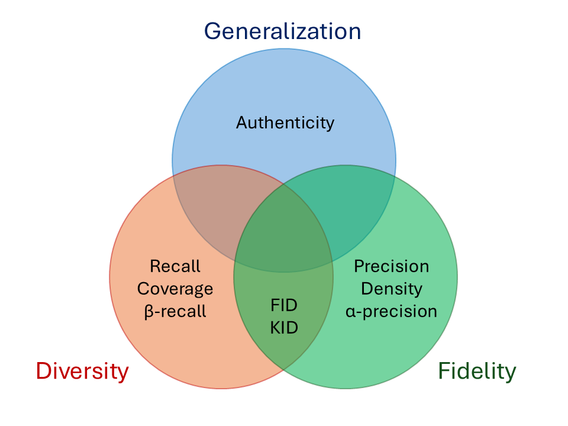
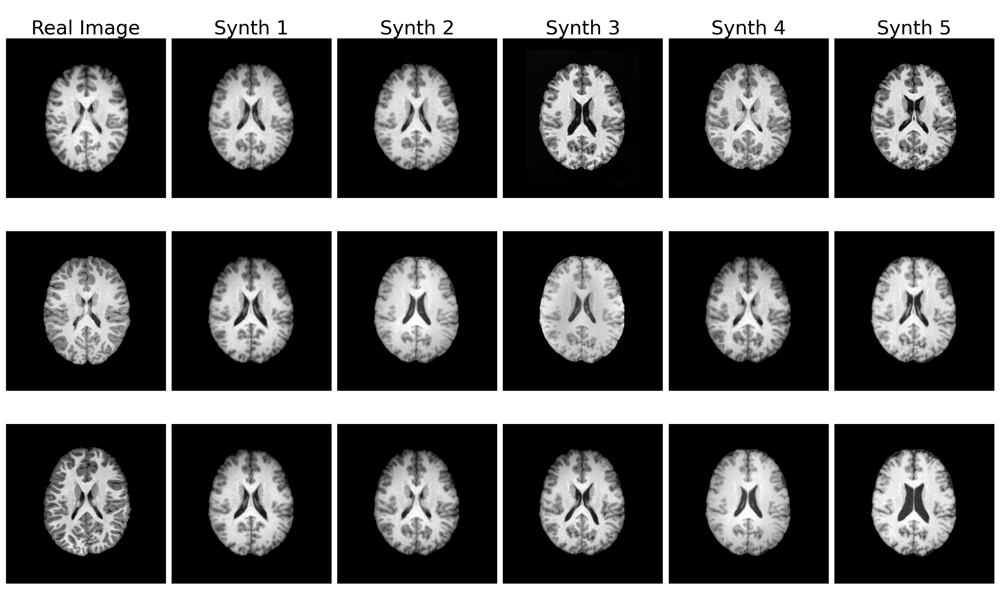

<!--
SPDX-FileCopyrightText: 2024 Matteo Lai <matteo.lai3@unibo.it>

SPDX-License-Identifier: NPOSL-3.0
-->

[](https://doi.org/10.5281/zenodo.14845935) [](<https://hub.docker.com/r/aiformedresearch/metrics_toolkit>) [](https://colab.research.google.com/drive/1EyO8hAu6sJw_gbE3bsHID-5IzUBjhm6B?usp=sharing)

# Synthetic_Images_Metrics_Toolkit

<p align="center">
  
</p>

The **Synthetic Images Metrics (SIM) Toolkit** provides a comprehensive collection of state-of-the-art metrics for evaluating the quality of 2D and 3D synthetic images. 

These metrics enable the assessment of:
- **Fidelity**: the realism of synthetic data;
- **Diversity**: the coverage of the real data distribution;
- **Generalization**: the generation of authentic, non-memorized images. 

### 📊 Automated Report Generation
This repository produces a comprehensive report as output, summarizing key findings and visualizations in a structured format.

Check out an **example report** here: 📄 [report_metrics_toolkit.pdf](https://drive.google.com/file/d/1K_H0KCjjqr6rfi1tHYk03Gy3WhdcyKjk/view?usp=sharing)

## Installation
Before proceeding, ensure that [CUDA](https://developer.nvidia.com/cuda-downloads) is installed. CUDA 11.0 or later is recommended.

### 🔧 Option 1: Install via Anaconda
0. Install [Anaconda](https://docs.anaconda.com/free/anaconda/install/index.html) for your operating system.
1. Clone the repository:
    ```
    cd /path_to/sim_toolkit_repo
    git clone https://github.com/aiformedresearch/Synthetic_Images_Metrics_Toolkit.git
    cd Synthetic_Images_Metrics_Toolkit
    ```
2. Create and activate the Conda environment:
    ```
    conda create -n sim_toolkit python=3.10 -y
    conda activate sim_toolkit
    ```
3. Install dependencies:
    ```
    pip install -r requirements.txt
    ```
    📌 To install additional dependencies for the tutorials with the pre-trained generators:
    ```
    pip install -r requirements_tutorial.txt
    ```
4. Install any additional packages needed for your specific use case. 

### 🐳 Option 2: Use Docker
0. Install [Docker](https://docs.docker.com/get-docker/) for your operating system.

1. Pull the Docker image
    ```
    docker pull aiformedresearch/metrics_toolkit:3.1
    ```

2. Run the Docker container
    ```
    docker run -it --gpus all \
      -v /absolute/path/to/real_data:/Synthetic_Images_Metrics_Toolkit/data \
      -v /absolute/path/to/config_file:/Synthetic_Images_Metrics_Toolkit/configs \
      -v /absolute/path/to/local_output_directory:/Synthetic_Images_Metrics_Toolkit/outputs \
      aiformedresearch/metrics_toolkit
    ```
      - The `--gpus all` flag enables GPU support. Specify a GPU if needed, e.g., `--gpus 0`.
      - The `-v` flag is used to mount the local directories to the working directory `Synthetic_Images_Metrics_Toolkit` inside the container. 

Refer to the [Usage](#usage) section for detailed instructions about running the main script. 


## Usage
### Step 1: Customize for your use case
To evaluate your generative model, tailor the configuration script to meet your specific needs. 

📖 Find here a [short tutorial](https://colab.research.google.com/drive/1EyO8hAu6sJw_gbE3bsHID-5IzUBjhm6B?usp=sharing) to use the SIM Toolkit with your data.

Key configuration options include:
- **Metrics**: Select metrics such as FID, KID, etc.
- **Runtime configurations**: Set up your working directory; select CPU or GPU; define data type (2D, 3D).
- **Metrics configurations**: Adjust the hyperparameters for metrics computation, if needed.
- **Real data configuration**: Define the function for data loading.
- **Synthetic data configuration**: Choose one of the following options:
    1. Load synthetic images directly from files or a folder;
    2. Define functions to load a pre-trained generator and generate new samples.

📝 [Detailed guide to build the configuration file](https://github.com/aiformedresearch/Synthetic_Images_Metrics_Toolkit/tree/main/configs)

### Step 2: Run the SIM Toolkit
Once customized the `config.py` script, execute the main script with:
```
python calc_metrics.py --config configs/config.py
```

## Metrics overview

<p align="center">
  
</p>

### Quantitative metrics
The following quantitative metrics are available:

| Metric flag      | Description | Original implementation |
| :-----        | :-----: | :---------- |
| `fid` | Fr&eacute;chet inception distance<sup>[1]</sup> against the full dataset | [Karras et al.](https://github.com/NVlabs/stylegan2-ada-pytorch)
| `kid` | Kernel inception distance<sup>[2]</sup> against the full dataset         | [Karras et al.](https://github.com/NVlabs/stylegan2-ada-pytorch)
| `is_`       | Inception score<sup>[3]</sup> against the full dataset (only 2D)                            | [Karras et al.](https://github.com/NVlabs/stylegan2-ada-pytorch)
| `prdc`    |  Precision, recall<sup>[4]</sup>, density, and coverage<sup>[5]</sup>  against the full dataset                    | [Naeem et al.](https://github.com/clovaai/generative-evaluation-prdc)
| `pr_auth`    |  	$\alpha$-precision, 	$\beta$-recall, and authenticity<sup>[6]</sup> against the full dataset  | [Alaa et al.](https://github.com/vanderschaarlab/evaluating-generative-models)

> ⚠️ 3D metrics rely on a 3D-ResNet50 feature extractor from [MedicalNet](https://github.com/Tencent/MedicalNet/tree/master), pre-trained on 23 medical imaging datasets. Before using these metrics, please verify that your data domain is represented among those datasets. If your dataset differs significantly from the pretraining domains, the resulting embeddings $-$ and therefore the computed metrics $-$ may not be meaningful. 

References:
1. [GANs Trained by a Two Time-Scale Update Rule Converge to a Local Nash Equilibrium](https://arxiv.org/abs/1706.08500), Heusel et al. 2017
2. [Demystifying MMD GANs](https://arxiv.org/abs/1801.01401), Bi&nacute;kowski et al. 2018
3. [Improved Techniques for Training GANs](https://arxiv.org/abs/1606.03498), Salimans et al. 2016
4. [Improved Precision and Recall Metric for Assessing Generative Models](https://arxiv.org/abs/1904.06991), Kynk&auml;&auml;nniemi et al. 2019
5. [A Style-Based Generator Architecture for Generative Adversarial Networks](https://arxiv.org/abs/1812.04948), Karras et al. 2018
6. [Reliable Fidelity and Diversity Metrics for Generative Models](https://proceedings.mlr.press/v119/naeem20a/naeem20a.pdf), Naeem et al., 2020
7. [How Faithful is your Synthetic Data?
Sample-level Metrics for Evaluating and Auditing Generative Models](https://proceedings.mlr.press/v162/alaa22a/alaa22a.pdf), Alaa et al., 2022

### Qualitative metrics
The SIM Toolkit automatically generates **t-SNE** and **PCA** visualizations of real and synthetic image embeddings for each metric, to qualitatively assess the fidelity and diversity of the synthetic images. These plots are included in the final report, which also provides detailed guidance to help users interpret the resulting metric scores.
You can view an example report [here](https://drive.google.com/file/d/1K_H0KCjjqr6rfi1tHYk03Gy3WhdcyKjk/view?usp=sharing).

In addition, the toolkit supports **k-NN analysis**, enabling users to qualitatively evaluate how well synthetic samples generalize with respect to real data:

| Metric flag      | Description | Original implementation |
| :-----        | :-----: | :---------- |
| `knn` | k-nearest neighbors (k-NN) analysis, to assess potential memorization of the model | [Lai et al.](https://github.com/aiformedresearch/Synthetic_Images_Metrics_Toolkit) |

<p align="center">
  
</p>

The k-NN analysis identifies and visualizes the `top_n` real images most similar to any synthetic sample (from a set of 50,000 generated samples). For each real image, the visualization displays the top `k` synthetic images ranked by their cosine similarity to the corresponding real image.

By default, `k=5` and `top_n=3`. These parameters can be customized in the *Metrics configurations* section of the configuration file.

## 🚧To-do list:
- [x] Simplify the procedure for data loading;

- [x] Allow to load synthetic images from files (as well as from a pre-trained generator);

- [x] 3D data support;

- [x] Implement PCA and t-SNE to qualitatively assess diversity.

## Licenses
This repository complies with the [REUSE Specification](https://reuse.software/). All source files are annotated with SPDX license identifiers, and full license texts are included in the `LICENSES` directory.

### Licenses Used

1. **LicenseRef-NVIDIA-1.0**: Applies to code reused from NVIDIA's StyleGAN2-ADA repository: https://github.com/NVlabs/stylegan2-ada-pytorch, under the [NVIDIA Source Code License](https://nvlabs.github.io/stylegan2-ada-pytorch/license.html).
2. **MIT**:  For code reused from:
    - https://github.com/vanderschaarlab/evaluating-generative-models; 
    - https://github.com/clovaai/generative-evaluation-prdc.
3. **BSD-3-Clause**: Applies to two scripts reused from https://github.com/vanderschaarlab/evaluating-generative-models;
4. **NPOSL-3.0**: Applies to the code developed specifically for this repository.

For detailed license texts, see the `LICENSES` directory.

## Aknowledgments
This repository builds on NVIDIA's StyleGAN2-ADA repository: https://github.com/NVlabs/stylegan2-ada-pytorch.
